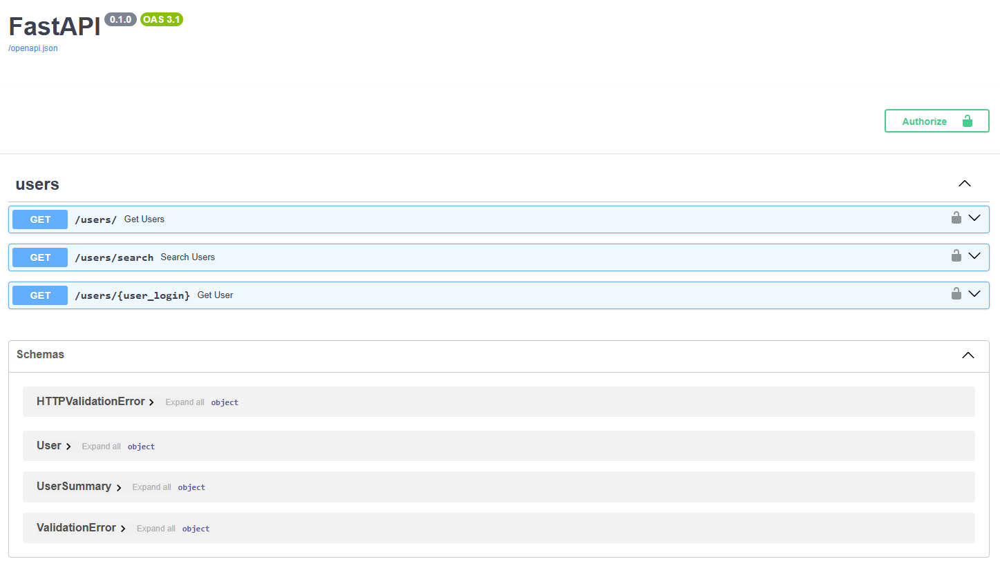
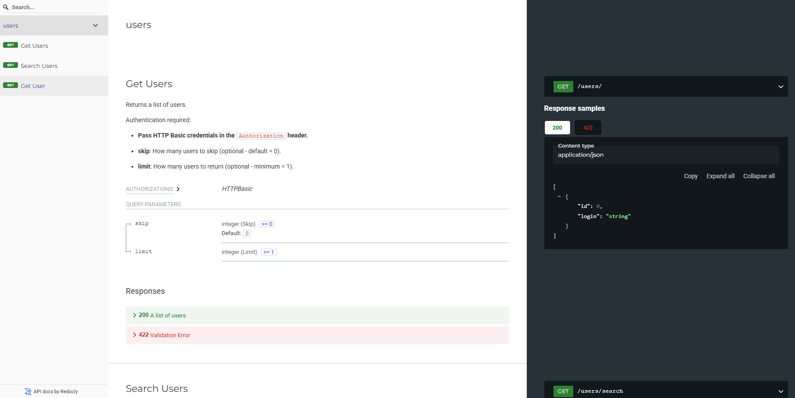

# 📦 GitHub Users Extractor & FastAPI API

Ce projet Python est structuré en deux volets :

1. **Extraction, nettoyage et filtrage de données d'utilisateurs GitHub**
2. **Exposition de ces données via une API REST sécurisée avec FastAPI**

---

## 📂 Structure du projet

```
.
├── api/
│   ├── main.py             # Point d'entrée de l'API FastAPI
│   ├── models.py           # Modèles Pydantic
│   ├── routes.py           # Endpoints de l'API
│   ├── security.py         # Logique de sécurité
│
├── data/
│   ├── users.json          # Données brutes extraites de GitHub
│   └── filtered_user.json  # Données nettoyées/filtrées prêtes à servir via l'API
│
├── tests/
│   └── test_api.py         # Tests unitaires de l'API
│
├── .env                    # Token GitHub & utilisateurs de l'API
├── .gitignore
├── extract_users.py
├── filtered_users.py
├── LICENSE
├── main.py                 # Script principal pour interroger l’API GitHub
├── README.md
├── requirements.txt        # Dépendances
```

---

## ⚖️ Prérequis

* Python **3.10**
* Un compte GitHub avec un **token personnel** (PAT)

---

## ⚙️ Installation et configuration

### 1. Créer un environnement virtuel

### 2. Installer les dépendances

```bash
pip install -r requirements.txt
```

### 3. Configurer le token GitHub

Dans le fichier `.env` à la racine du projet, ajouter :

```env
GITHUB_TOKEN=ton_token_github_ici
```

---

## 🧰 Extraction et traitement des utilisateurs

### 1. Extraire les données de GitHub

`extract_users.py` contient les fonctions permettant d'interroger l'API GitHub pour en récupérer les utilisateurs et leur détail, et les enregistrer localement au format JSON.
`filtered_users.py` contient les fonctions de nettoyage et filtrage de ces données brutes pour ne garder que les utilisateurs inscrits après une certaine période, avec une bio et un avatar valide.
Pour effectuer ce travail, lancer :

```bash
python main.py
```

→ Génère `data/users.json` & `data/filtered_user.json`

---

## 🌐 Lancer l’API FastAPI

```bash
uvicorn api.main:app
```

API disponible par défaut sur `http://127.0.0.1:8000`  
Documentation ReDoc disponible par défaut sur `http://127.0.0.1:8000/redoc`
Documentation Swagger disponible par défaut sur `http://127.0.0.1:8000/docs`

---

## 📚 Endpoints principaux

* `GET /users` — Liste filtrée des utilisateurs (`id`, `login`)
* `GET /users/{login}` — Détails d’un utilisateur (`id`, `login`, `created_at`, `avatar_url`, `bio`)
* `GET /users/search?q=<texte>` — Recherche partielle sur le login (`id`, `login`)

---

## 🔒 Sécurité

L’API est conçue pour être sécurisée. La logique est gérée dans `api/security.py`.
La liste d'utilisateurs autorisés se trouve dans `.env`

---

## 🧪 Tester l’API

L’API est protégée par authentification basique. Il faut fournir des identifiants via un en-tête HTTP `Authorization` encodé en **Basic Auth**.  
Exemple d’utilisateur (défini dans `.env`) :

```json
{
  "login": "test",
  "password": "1234"
}
```

L’encodage en base64 de `test:1234` donne :  
`dGVzdDoxMjM0`

À utiliser ainsi dans les requêtes :

```
Authorization: Basic dGVzdDoxMjM0
```

---

## 🧾 Endpoints & Exemples

### ▶️ `GET /users`  
Liste des utilisateurs filtrés (affiche `id` et `login` uniquement).

#### 🔹 Requête `curl` :

```bash
curl -X GET http://127.0.0.1:8000/users \
  -H "Authorization: Basic dGVzdDoxMjM0"
```

#### 🔹 Réponse JSON :

```json
[
  {
    "id": 6519166892,
    "login": "anonymized_login"
  },
  {
    "id": 6519166893,
    "login": "anonymized_login2"
  }
]
```

---

### ▶️ `GET /users/{login}`  
Détail complet d’un utilisateur.

#### 🔹 Requête `curl` :

```bash
curl -X GET http://127.0.0.1:8000/users/anonymized_login \
  -H "Authorization: Basic dGVzdDoxMjM0"
```

#### 🔹 Réponse JSON :

```json
{
  "login": "anonymized_login",
  "id": 6519166892,
  "created_at": "2015-01-01T00:11:45Z",
  "avatar_url": "https://avatars.githubusercontent.com/u/6519166892?v=4",
  "bio": "Anonymized bio."
}
```

---

### ▶️ `GET /users/search?q=<fragment>`  
Recherche les utilisateurs dont le login contient le fragment recherché.

#### 🔹 Requête `curl` :

```bash
curl -X GET "http://127.0.0.1:8000/users/search?q=nymiz" \
  -H "Authorization: Basic dGVzdDoxMjM0"
```

#### 🔹 Réponse JSON :

```json
[
  {
    "id": 6519166892,
    "login": "anonymized_login"
  },
  {
    "id": 6519166893,
    "login": "anonymized_login2"
  }
]
```

---

## 📘 Documentation interactive

Une fois le serveur lancé avec :

```bash
uvicorn api.main:app
```

Tu peux explorer et tester l’API depuis une interface web :

- Swagger UI : [http://127.0.0.1:8000/docs](http://127.0.0.1:8000/docs)
- ReDoc : [http://127.0.0.1:8000/redoc](http://127.0.0.1:8000/redoc)

Il faudra **cliquer sur "Authorize"** et entrer les identifiants définis dans `.env` pour tester les requêtes.




---

## ✅ Lancer les tests unitaires

Les tests unitaires de l'API permettent de vérifier que l'authentification fonctionne et que les retours sont du type attendu :

```bash
pytest -v
```

---

## 🛠️ Technologies

* Python 3.10
* FastAPI
* Uvicorn
* dotenv
* GitHub REST API
* Pytest

---

## 📄 Licence

Ce projet est sous licence MIT.

---

## 👤 Auteur

Développé par [@CpHeat](https://github.com/CpHeat)